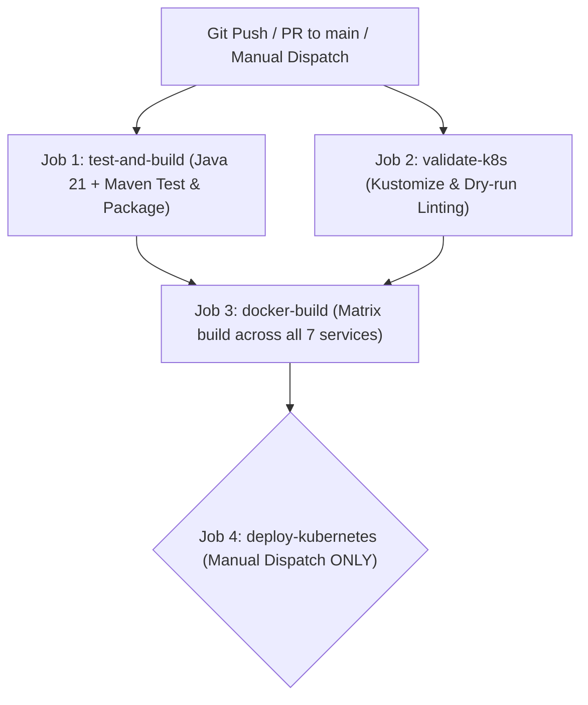

# microservices-pro-platform

**Microservices Course — Spring Boot & Spring Cloud, Professional Edition**
ITSharks · IT Learning & Training Center

This is the **Enterprise E-Commerce Platform** — the production-grade system built session after session across the curriculum. Every lab adds concrete capabilities to this real platform.

---

## Architecture Overview

| Module | Port | Technology Stack | Role / Responsibility |
|---|---|---|---|
| `infrastructure/eureka-server` | 8761 | Spring Cloud Netflix Eureka | Service Discovery Registry |
| `infrastructure/config-server` | 8888 | Spring Cloud Config | Centralized Configuration Server |
| `infrastructure/api-gateway` | 8080 | Spring Cloud Gateway, Reactive Redis | API Entry Point, Dynamic Routing, JWT Auth, Token-Bucket Rate Limiting |
| `services/product-service` | 8081 | Spring Boot, Spring Data JPA, Redis | Product Catalog REST API, JPA + Redis Two-Level Cache |
| `services/order-service` | 8082 | Spring Boot, OpenFeign, Resilience4j, Kafka | Order Orchestration, Feign Stock Pre-Check, Saga Initiator |
| `services/payment-service` | 8083 | Spring Boot, Spring Kafka | Payment Processing, Configurable Failure/Delay Simulation, Saga Participant |
| `services/inventory-service` | 8084 | Spring Boot, Spring Kafka | Synchronous Stock Checks, Saga Commit/Compensation (Stock Reserve & Release) |
| `tools/jwt-generator` | CLI | Java 21, JJWT | Standalone Developer CLI to issue signed test JWT tokens |

---

## Prerequisites

- **Java JDK 21+** (`java -version`)
- **Apache Maven 3.9+** (`mvn -version`)
- **Docker & Docker Compose** (`docker compose version`)
- **Kubernetes cluster & kubectl** (for Kubernetes deployment; e.g. Minikube, Kind, k3s, EKS, GKE, AKS)
- **curl** or **Postman / Bruno / HTTPie**

---

## Building the Platform

A root aggregator `pom.xml` links all services. You can compile and test the entire platform from the repository root:

```bash
# Run unit and integration tests across all modules
mvn test

# Package all JAR artifacts
mvn clean package -DskipTests
```

---

## Running the Platform

You can run the entire platform in three modes:
- **Mode A: Full Stack in Docker** (recommended for full system testing on a local machine)
- **Mode B: Hybrid Local Development** (infrastructure in Docker, microservices run locally via Maven)
- **Mode C: Kubernetes Cluster Deployment** (orchestrated container deployment via Kustomize)

---

### Mode A: Full Platform via Docker Compose

In this mode, Docker Compose boots all backing infrastructure and all containerized Spring microservices using multi-stage builds.

1. **Build and start all services:**
   ```bash
   docker compose up --build
   ```

   To run in the background (detached mode):
   ```bash
   docker compose up --build -d
   ```

2. **Verify running containers:**
   ```bash
   docker compose ps
   ```

   All services will show `Up` and `healthy`:
   - `postgres` (port 5432)
   - `redis` (port 6379)
   - `zookeeper` (port 2181)
   - `kafka` (internal port 29092, host port 9092)
   - `eureka-server` (port 8761)
   - `config-server` (port 8888)
   - `api-gateway` (port 8080)
   - `product-service` (port 8081)
   - `order-service` (port 8082)
   - `payment-service` (port 8083)
   - `inventory-service` (port 8084)

3. **Stop the stack:**
   ```bash
   docker compose down
   ```

---

### Mode B: Hybrid Local Development (Maven)

In this mode, backing infrastructure runs in Docker containers while you run and debug Spring Boot services individually in your IDE or via Maven CLI.

1. **Start backing infrastructure:**
   ```bash
   docker compose up -d postgres redis zookeeper kafka
   ```

2. **Start Infrastructure Services in order:**
   - **Terminal 1 — Config Server:**
     ```bash
     cd infrastructure/config-server
     mvn spring-boot:run
     ```
     *Wait until `http://localhost:8888/product-service/default` responds.*

   - **Terminal 2 — Eureka Server:**
     ```bash
     cd infrastructure/eureka-server
     mvn spring-boot:run
     ```
     *Dashboard available at `http://localhost:8761`.*

   - **Terminal 3 — API Gateway:**
     ```bash
     cd infrastructure/api-gateway
     mvn spring-boot:run
     ```

3. **Start Core Microservices:**
   - **Terminal 4 — Product Service:**
     ```bash
     cd services/product-service
     mvn spring-boot:run
     ```

   - **Terminal 5 — Inventory Service:**
     ```bash
     cd services/inventory-service
     mvn spring-boot:run
     ```

   - **Terminal 6 — Payment Service:**
     ```bash
     cd services/payment-service
     mvn spring-boot:run
     ```

   - **Terminal 7 — Order Service:**
     ```bash
     cd services/order-service
     mvn spring-boot:run
     ```

---

### Mode C: Kubernetes Cluster Deployment

Production-ready Kubernetes manifests are provided under the `k8s/` directory and structured with Kustomize.

#### 1. Manifest Structure

```
k8s/
├── 00-namespace.yml          # microservices-pro namespace
├── 01-configmaps.yml         # Shared platform environment configuration
├── 02-secrets.yml            # Secrets placeholders (Postgres password, JWT secret, Registry credentials)
├── 03-infrastructure.yml     # PostgreSQL, Redis, ZooKeeper, and Kafka Deployments & Services
├── 04-eureka-server.yml      # Service registry with readiness/liveness probes & resource limits
├── 05-config-server.yml      # Central config service with probes & limits
├── 06-api-gateway.yml        # Spring Cloud Gateway deployment & ClusterIP service
├── 07-product-service.yml    # Product catalog service deployment & service
├── 08-order-service.yml      # Order orchestration service deployment & service
├── 09-payment-service.yml    # Payment processing service deployment & service
├── 10-inventory-service.yml  # Inventory management service deployment & service
├── 11-ingress.yml            # NGINX Ingress resource routing public traffic to api-gateway:8080
└── kustomization.yml         # Kustomize manifest aggregating all resources
```

#### 2. Configure Secrets

Before deploying to production, replace placeholders in `k8s/02-secrets.yml` or supply secrets directly:

```bash
# Example: create the namespace and secrets imperatively
kubectl create namespace microservices-pro
kubectl create secret generic platform-secrets \
  --namespace microservices-pro \
  --from-literal=POSTGRES_PASSWORD='your-strong-db-password' \
  --from-literal=SPRING_DATASOURCE_PASSWORD='your-strong-db-password' \
  --from-literal=JWT_SECRET='your-32-byte-or-longer-hmac-sha-secret-key!'
```

#### 3. Deploy All Components

Apply the entire stack using Kustomize:

```bash
kubectl apply -k k8s/
```

Verify that all deployments, pods, and services are running:

```bash
kubectl get pods -n microservices-pro
kubectl get svc -n microservices-pro
kubectl get ingress -n microservices-pro
```

#### 4. Accessing Services

- **Via Ingress Controller:** If an Ingress Controller (e.g. `ingress-nginx`) is installed, send requests directly to the host/IP configured on the Ingress resource:
  ```bash
  curl http://<INGRESS_IP>/api/v1/products
  ```
- **Via Port-Forwarding:** For local testing on Minikube or Kind:
  ```bash
  kubectl port-forward svc/api-gateway -n microservices-pro 8080:8080
  ```
  Now access the API Gateway locally at `http://localhost:8080`.

#### 5. Teardown

To delete all deployed resources:
```bash
kubectl delete -k k8s/
```

---

## Continuous Integration & Continuous Deployment (CI/CD)

The repository includes a complete GitHub Actions workflow located at `.github/workflows/ci-cd.yml`.

### Pipeline Architecture



1. **Job 1: `test-and-build`**
   - Checks out the repository and sets up Java 21 Temurin with Maven caching.
   - Runs `mvn clean test` across the full reactor.
   - Runs `mvn package -DskipTests` to package all executable JAR artifacts.

2. **Job 2: `validate-k8s`**
   - Sets up `kubectl`.
   - Runs `kubectl kustomize k8s/` and client-side dry-run validation to guarantee zero schema or reference errors.

3. **Job 3: `docker-build`**
   - Runs concurrently across all 7 Java services using a GitHub Actions matrix.
   - Uses Docker Buildx to build multi-stage Dockerfiles.
   - If registry credentials are provided in GitHub Secrets, tags images with Git SHA and `latest` and pushes them to the container registry.

4. **Job 4: `deploy-kubernetes` (Gated / Manual Only)**
   - **Safety First:** Never deploys automatically on commit or PR.
   - Requires explicit manual trigger via GitHub Actions `workflow_dispatch` with input `deploy_k8s: true`.
   - Applies `k8s/` to the target cluster configured in `secrets.KUBECONFIG`.

### Required & Optional GitHub Secrets

To enable container registry push and automated cluster deployment, configure the following secrets in **Settings > Secrets and variables > Actions**:

| Secret Name | Required For | Description | Example Value |
|---|---|---|---|
| `REGISTRY_USERNAME` | Docker image push | Username for Docker Hub or container registry | `my-docker-user` |
| `REGISTRY_PASSWORD` | Docker image push | Password or Personal Access Token (PAT) | `dckr_pat_xxxx` |
| `REGISTRY_URL` | Docker image push *(Optional)* | Container registry hostname (defaults to Docker Hub) | `ghcr.io` or `quay.io` |
| `REGISTRY_NAMESPACE` | Docker image push *(Optional)* | Organization or repository namespace | `my-org` |
| `KUBECONFIG` | Manual K8s deployment *(Optional)* | Kubeconfig file content for the target Kubernetes cluster | `apiVersion: v1...` |

---

## Authentication & Generating Test JWTs

The platform enforces JWT validation at the API Gateway (`api-gateway`) using an HMAC-SHA256 signature with the shared secret key.

To generate a signed test JWT:

```bash
cd tools/jwt-generator
mvn compile exec:java -Dexec.mainClass="com.microservices.pro.jwtgenerator.JwtGeneratorApplication"
```

Save the generated token and use it as an `Authorization: Bearer <TOKEN>` header in authenticated requests.

---

## End-to-End Verification & API Testing

Once the platform is running, test end-to-end functionality through the API Gateway at `http://localhost:8080`.

### 1. Eureka Service Registry
Open your browser to:
```
http://localhost:8761
```
Verify that `API-GATEWAY`, `PRODUCT-SERVICE`, `ORDER-SERVICE`, `INVENTORY-SERVICE`, and `PAYMENT-SERVICE` are registered.

### 2. Product Catalog (Public Route + Redis Caching)
Fetch products through the Gateway:
```bash
curl -i http://localhost:8080/api/v1/products
```

Create a new product:
```bash
curl -i -X POST http://localhost:8080/api/v1/products \
  -H "Content-Type: application/json" \
  -d '{"name": "Wireless Headphones", "price": 129.99, "category": "ELECTRONICS"}'
```

### 3. Inventory Stock Check (Public Route)
Check stock availability for a product:
```bash
curl -i "http://localhost:8080/api/v1/inventory/check?productId=PROD-001&quantity=2"
```

### 4. Create Order & Trigger Saga Workflow (Protected Route)
Create an order with your JWT token. This initiates:
1. Synchronous stock pre-check via OpenFeign to `inventory-service`.
2. Persisting order with `PENDING` status.
3. Publishing `OrderPlacedEvent` to Kafka topic `order-events`.
4. `inventory-service` reserves inventory and emits `InventoryReservedEvent`.
5. `payment-service` processes payment and emits `PaymentCompletedEvent` (or `PaymentFailedEvent`).
6. `order-service` updates status to `CONFIRMED` (or triggers compensation and sets `CANCELLED`).

```bash
export TOKEN="<YOUR_GENERATED_JWT_TOKEN>"

curl -i -X POST http://localhost:8080/api/v1/orders \
  -H "Authorization: Bearer $TOKEN" \
  -H "Content-Type: application/json" \
  -d '{"productId": "PROD-001", "quantity": 1, "amount": 99.99, "customerId": "CUST-001"}'
```

Response:
```json
{
  "orderId": "3fa85f64-5717-4562-b3fc-2c963f66afa6",
  "status": "PENDING",
  "message": "Order received — processing..."
}
```

### 5. Check Order Saga Status
Query the order status using the `orderId` from the previous response:
```bash
curl -i http://localhost:8080/api/v1/orders/3fa85f64-5717-4562-b3fc-2c963f66afa6/status
```

Expected status: `"CONFIRMED"` (or `"CANCELLED"` if payment simulation failed).

---

## Health Checks & Actuators

Every service exposes Spring Boot Actuator endpoints for liveness and readiness monitoring:

- API Gateway: `http://localhost:8080/actuator/health`
- Product Service: `http://localhost:8081/actuator/health`
- Order Service: `http://localhost:8082/actuator/health`
- Payment Service: `http://localhost:8083/actuator/health`
- Inventory Service: `http://localhost:8084/actuator/health`
- Eureka Server: `http://localhost:8761/actuator/health`
- Config Server: `http://localhost:8888/actuator/health`

---

*ITSharks · IT Learning & Training Center · microservices-pro-platform*
